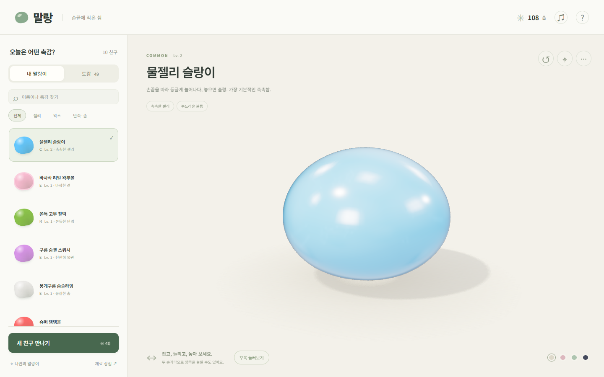

# 말랑 — 손끝에 작은 쉼

**[지금 만져보기](https://nam5an.github.io/malang-3d/)**



## v2 · 처음부터 다시 만든 3D 연체

2D 윤곽을 부풀리던 이전 구현은 제거했습니다. [원작 말랑](https://github.com/NAM5AN/malang)의 49가지 친구와 수집·꾸미기 기획만 가져와 물리, 표면, 입력, 화면, 저장을 새로 작성했습니다.

말랑이의 내부는 **216개 입자와 750개 사면체**로 채워져 있습니다. 각 사면체의 부피를 유지하는 XPBD 제약과 탄성 제약을 계산하고, **5,402개 정점의 매끈한 표면**이 내부 움직임을 따릅니다. 손가락은 한 정점이 아니라 넓은 영역을 잡습니다. [원리와 범위](docs/SOFT_BODY.md).

- 젤리는 출렁이고, 고무는 빠르게 돌아오고, 스퀴시는 천천히 복원되고, 점토는 모양을 기억합니다.
- 하트·클로버·생쥐·해파리, 오로라·우주·금속, 비즈·가루·기포 등 각 친구의 특징을 새 3D 표현으로 구현했습니다.
- 왁스는 실제 왁뿌볼 개발 작업물을 참고해 별도로 구현했습니다. 접촉한 곳에 금이 생기고 두께가 있는 조각이 떨어져 속살이 드러납니다. 얇은 설탕, 두꺼운 초코, 얼음, 금빛 코팅의 타격 횟수와 두께가 다릅니다. [참고한 코드](docs/WAX_REFERENCES.md).
- 49종 무료 미리 만져보기, 내 말랑이, 뽑기와 중복 레벨, 재료 상점, 꾸미기, 이름 변경, 보내주기를 제공합니다.
- 컴퓨터의 드래그와 휴대폰의 두 손가락 입력을 지원합니다.

## 실행

Node.js 22.12 이상에서:

```sh
npm ci
npm run dev
```

```sh
npm test
npm run build
npm run preview
```

`dist/`는 정적 사이트입니다. `main`에 올리면 GitHub Actions가 검사·빌드한 뒤 GitHub Pages에 배포합니다.

## 조작과 수집

| 조작                                     | 반응                               |
| ---------------------------------------- | ---------------------------------- |
| 누르기 / 잡고 드래그                     | 넓게 눌러 주무르기 / 둥글게 늘리기 |
| 두 손가락으로 서로 다른 곳 잡기          | 양쪽 늘리기                        |
| 같은 왁스 부위 반복 클릭 / 길게 누르기   | 균열 → 코팅 조각 분리              |
| 오른쪽 버튼 드래그 / 모바일 빈 공간 쓸기 | 시점 회전                          |
| 휠 / 빈 공간 두 손가락 핀치              | 확대·축소                          |
| 캔버스에 초점을 둔 뒤 Space / Enter      | 꾸욱 누르기                        |
| ↺ / ⌖                                    | 모양 복원 / 시점 복원              |

처음에 8종과 180 솜, 꾸미기 재료를 받습니다. 다섯 번 주무를 때마다 2 솜을 얻고, 40 솜으로 새 친구와 재료를 뽑습니다. 레벨 2부터 꾸밀 수 있으며 시작 물젤리는 바로 꾸밀 수 있습니다. 도감의 미보유 친구도 자유롭게 체험할 수 있습니다.

v2의 보관함은 이 브라우저의 `malang-volume-studio-v2`에 저장됩니다. 이전 버전과 별개의 새 보관함으로 시작합니다.

## 코드

| 파일                         | 역할                                                             |
| ---------------------------- | ---------------------------------------------------------------- |
| `src/physics/volume-body.js` | 사면체 XPBD, 부피·탄성·접촉, 잡기, 점탄성·소성, 매끈한 표면 연결 |
| `src/render/skin.js`         | 닫힌 고해상도 표면                                               |
| `src/render/coating.js`      | 국소 왁스 균열, 껍질 제거, 두께 있는 조각                        |
| `src/render/studio.js`       | 조명·재질·장식·입력·소리                                         |
| `src/catalog.js`             | 49종 기획과 새 물성 설정                                         |
| `src/collection.js`          | 새 보관함과 수집 규칙                                            |
| `src/app.js`, `src/ui.css`   | 새 화면과 흐름                                                   |

[검증 결과](docs/VERIFICATION.md) · [물리 참고 자료](docs/SOFT_BODY.md) · [외부 소프트웨어 고지](THIRD_PARTY_NOTICES.md)
